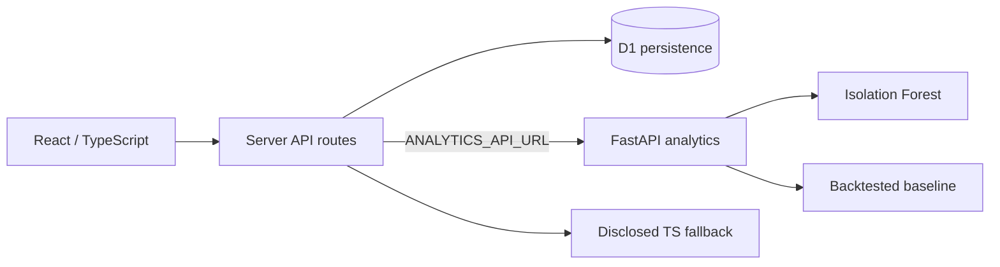

# SignalBoard AI

SignalBoard is a portfolio-grade executive analytics prototype for SaaS companies. It combines an interactive React/TypeScript application, durable workflow state, CSV ingestion, and a separately deployable Python/FastAPI analytics service.

**Hosted application:** [signalboard-ai.nikhilthanda6.chatgpt.site](https://signalboard-ai.nikhilthanda6.chatgpt.site)
**API documentation when running locally:** [http://localhost:8000/docs](http://localhost:8000/docs)

## Implemented capabilities

- KPI views for revenue, retention, margin, runway, customers, and product adoption
- Searchable customer-health and renewal portfolio
- Pricing, churn, and hiring scenario calculations
- Durable saved scenarios, alert states, and CSV import history using D1
- Identity-scoped writes using the authenticated-user header supplied by the hosting platform
- Working `customer,mrr` CSV ingestion with validation and calculated MRR/ARR
- Python Isolation Forest anomaly detection with severity scores
- Explainable customer-health scoring with per-driver impact
- Linear-trend revenue baseline with chronological holdout validation, MAE, RMSE, MAPE, and residual intervals
- Optional React server-route proxy to the FastAPI service through `ANALYTICS_API_URL`, with an explicitly labeled deterministic fallback
- GitHub Actions validation for the TypeScript application and Python API

## Honest product boundary

The hosted application uses fictional seed data. Stripe, Salesforce, HubSpot, and warehouse cards describe the connector roadmap; they do not claim live OAuth integrations. The executive briefing is deterministic and templated. Forecasting is a transparent baseline—not a claim of production predictive accuracy. The deployed application only reports `python_fastapi` as its analytics source when `ANALYTICS_API_URL` is configured successfully.

## Architecture



## Run locally

```bash
npm ci
npm run dev
```

Run the Python service:

```bash
cd backend
python -m venv .venv
. .venv/bin/activate
pip install -r requirements.txt
uvicorn app.main:app --reload
```

Then set `ANALYTICS_API_URL=http://localhost:8000` for the web runtime. The Python service can also be built with:

```bash
docker build -t signalboard-analytics ./backend
docker run --rm -p 8000:8000 signalboard-analytics
```

## Verification

```bash
npm run lint
npm run build
PYTHONPATH=backend python -m pytest backend/tests
```

## Production gaps intentionally not overstated

- External OAuth connectors and webhooks are not implemented yet.
- The production Python container requires a separate container host; GitHub Pages cannot execute Python services.
- Forecast quality must be re-evaluated on real company history before operational use.
- The demo is not a substitute for audited financial reporting.

All organizations and figures in the seed dataset are fictional. Development was completed with AI-assisted coding tools and human-directed product decisions and verification.
